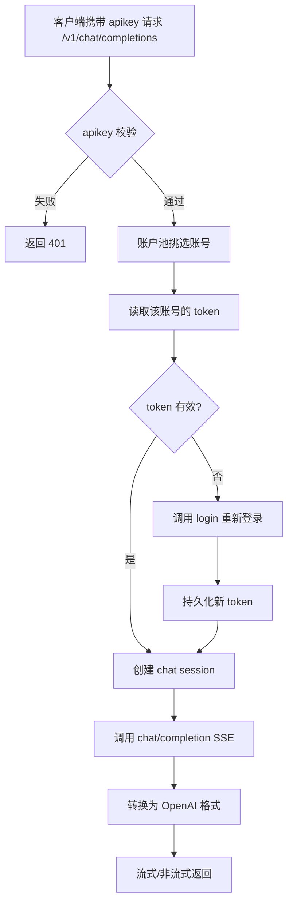

# PRD - soloDeepSeek API 网关

## 1. 产品概述

soloDeepSeek 是一个将 `chat.deepseek.com` 站点能力包装为 OpenAI 兼容 API 的轻量级网关服务,支持 Vercel Serverless 部署。通过环境变量配置多账户池和 API 密钥,实现负载均衡、token 持久化与自动重新登录,统一对外提供 OpenAI 标准的 `/v1/chat/completions` 与 `/v1/models` 接口。

## 2. 核心功能

### 2.1 账户与鉴权

| 配置项 | 环境变量 | 格式 | 说明 |
|--------|----------|------|------|
| 账户池 | `admin` | `账号1:密码1,账号2:密码2` | 多账号轮询使用 |
| API 密钥池 | `apikey` | `key1,key2,key3` | 客户端访问网关的凭证 |
| `/v1/models` | - | - | **无需 API Key 即可访问** |

### 2.2 接口模块

1. **POST /v1/chat/completions**: OpenAI 兼容对话接口(支持流式与非流式)
2. **GET /v1/models**: 动态模型列表(无需鉴权)
3. **GET /healthz**: 健康检查

### 2.3 接口详情

| 端点 | 模块 | 功能描述 |
|------|------|----------|
| `/v1/chat/completions` | 请求体解析 | 解析 OpenAI 标准的 `messages`/`model`/`stream`/`temperature` 等字段 |
| `/v1/chat/completions` | 账户调度 | 从账户池中按策略选择一个可用账号 |
| `/v1/chat/completions` | 思考与正文 | 响应中包含 `reasoning_content`(思考)与 `content`(正文) |
| `/v1/models` | 模型列表 | 动态从 deepseek 拉取模型,无需 API Key |
| `/healthz` | 健康检查 | 返回 200,无外部依赖 |

### 2.4 token 管理

- **持久化**: token 保存到 `/tmp/tokens.json`(Vercel Serverless 唯一可写目录)
- **复用**: 启动时按 mobile 优先加载磁盘 token
- **校验**: 使用前调用 `current_user` 校验,无效时丢弃
- **自动重登**: 校验失败或 token 缺失时调用 `login` 重新登录
- **保存**: 登录成功后立即写回磁盘

## 3. 核心流程

### 3.1 客户端调用流程

### 3.2 /v1/models 流程

## 4. 接口设计

### 4.1 接口风格

- 协议: HTTP/1.1 与 HTTP/2
- 数据格式: JSON 请求体 + JSON/SSE 响应
- 错误格式: OpenAI 风格 `{"error": {"message": "...", "type": "...", "code": "..."}}`
- 流式响应: `Content-Type: text/event-stream`,chunk 间以 `\n\n` 分隔,`data: [DONE]` 收尾

### 4.2 响应设计概览

| 端点 | 鉴权 | Content-Type | 返回示例 |
|------|------|--------------|----------|
| `/v1/chat/completions` | Bearer apikey | `application/json` 或 `text/event-stream` | OpenAI 标准格式 |
| `/v1/models` | 无 | `application/json` | `{"object":"list","data":[...]}` |
| `/healthz` | 无 | `application/json` | `{"status":"ok"}` |

### 4.3 响应能力

- Serverless 部署,冷启动 < 5s
- 单次 SSE 响应可持续 180s(对应 DeepSeek 长上下文/联网搜索)
- 同一账户并发受限于 DeepSeek 站点限制,账户池通过轮询分散压力

### 4.4 部署场景适配(若适用)

- 平台: Vercel Serverless Functions (Python 3.11)
- 函数内存: 1024 MB(为 wasmtime 预留)
- 函数超时: 300s
- 环境: 通过 Vercel Dashboard 或 `vercel env add` 配置

## 5. 关键场景

1. **多账户轮询**: 同一 API Key 的连续请求分散到不同账号,避免单账号限流
2. **Token 失效自动重登**: 调用前校验,失败/过期时自动重新登录并持久化
3. **思考与正文分离**: 响应中通过 `reasoning_content` 字段单独返回模型思考过程
4. **Vercel 部署**: `/tmp` 目录持久化 token,模块级缓存复用 warm 实例状态
