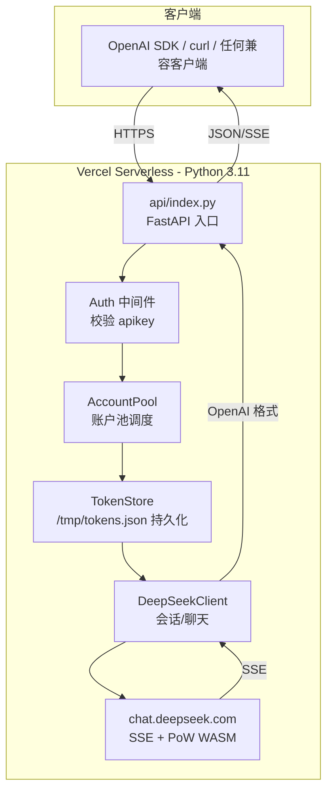
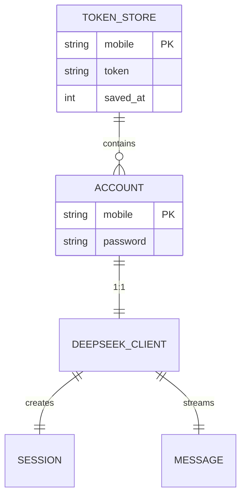

# 技术架构文档 - soloDeepSeek API 网关

## 1. 架构设计



## 2. 技术栈

- **运行时**: Python 3.11(Vercel 默认)
- **Web 框架**: FastAPI(异步、原生支持流式响应)
- **HTTP 客户端**: httpx(同步/异步均支持,SSE 友好)
- **PoW 计算**: wasmtime(嵌入 DeepSeekHashV1 WASM)
- **数据校验**: Pydantic v2
- **持久化**: 本地 JSON 文件 `/tmp/tokens.json`(Vercel 唯一可写目录)
- **部署平台**: Vercel Serverless Functions

## 3. 目录结构

```
/workspace
├── api/
│   ├── index.py            # FastAPI 入口,所有路由
│   └── deepseek.py         # DeepSeek 客户端(从根目录迁移并精简)
├── vercel.json             # Vercel 配置
├── requirements.txt        # 依赖
├── .env.example            # 环境变量示例
└── README.md
```

## 4. 路由定义

| 路由 | 方法 | 鉴权 | 用途 |
|------|------|------|------|
| `/v1/chat/completions` | POST | Bearer apikey | OpenAI 兼容对话(支持 stream) |
| `/v1/models` | GET | **无** | 动态模型列表 |
| `/healthz` | GET | 无 | 健康检查 |

## 5. API 定义

### 5.1 POST /v1/chat/completions

**请求** (OpenAI 兼容):
```json
{
  "model": "default",
  "messages": [
    {"role": "system", "content": "你是一个助手"},
    {"role": "user", "content": "你好"}
  ],
  "stream": false,
  "temperature": 1.0
}
```

**响应(非流式)**:
```json
{
  "id": "chatcmpl-xxx",
  "object": "chat.completion",
  "created": 1734567890,
  "model": "default",
  "choices": [{
    "index": 0,
    "message": {
      "role": "assistant",
      "content": "你好!",
      "reasoning_content": "用户问好,应回应问候。"
    },
    "finish_reason": "stop"
  }],
  "usage": {
    "prompt_tokens": 0,
    "completion_tokens": 12,
    "total_tokens": 12
  }
}
```

**响应(SSE 流式)**:
```
data: {"id":"chatcmpl-xxx","object":"chat.completion.chunk","choices":[{"index":0,"delta":{"role":"assistant"}}]}

data: {"id":"chatcmpl-xxx","object":"chat.completion.chunk","choices":[{"index":0,"delta":{"reasoning_content":"用户问好"}}]}

data: {"id":"chatcmpl-xxx","object":"chat.completion.chunk","choices":[{"index":0,"delta":{"content":"你好"}}]}

data: [DONE]
```

### 5.2 GET /v1/models (无需鉴权)

**响应**:
```json
{
  "object": "list",
  "data": [
    {"id": "default", "object": "model", "created": 1734567890, "owned_by": "deepseek"},
    {"id": "expert",  "object": "model", "created": 1734567890, "owned_by": "deepseek"}
  ]
}
```

### 5.3 错误格式(OpenAI 兼容)

```json
{
  "error": {
    "message": "Invalid API key",
    "type": "invalid_request_error",
    "code": "invalid_api_key"
  }
}
```

## 6. 服务端架构

```mermaid
flowchart LR
    REQ[Request] --> MID[Auth Middleware]
    MID --> ROUTE[Route Handler]
    ROUTE --> SVC[Service Layer]
    SVC --> POOL[AccountPool]
    SVC --> STORE[TokenStore]
    SVC --> CLIENT[DeepSeekClient]
    POOL --> CLIENT
    STORE -.读取/写入.-> DISK[/tmp/tokens.json]
    CLIENT --> WASM[PoW WASM]
    CLIENT --> HTTP[chat.deepseek.com]
```

### 6.1 模块职责

| 模块 | 职责 |
|------|------|
| `Auth Middleware` | 解析 `Authorization: Bearer <key>`,校验是否在 `apikey` 列表(白名单 `/v1/models`/`/healthz`) |
| `AccountPool` | 解析 `admin` 环境变量,提供 `pick()` 轮询;提供 `get_client(mobile)` 取具体客户端 |
| `TokenStore` | 加载/保存 `/tmp/tokens.json`,按 `mobile` 索引 token;提供 `get_token`/`set_token` |
| `DeepSeekClient` | 封装登录、PoW、SSE 解析;提供 `openai_chat()` 直接吐出 OpenAI 格式 |

### 6.2 TokenStore 持久化格式

`/tmp/tokens.json`:
```json
{
  "15814682408": {
    "token": "eyJhbGc...",
    "saved_at": 1734567890
  },
  "13800001111": {
    "token": "eyJhbGc...",
    "saved_at": 1734567900
  }
}
```

## 7. 数据模型

### 7.1 模型定义



### 7.2 内存数据结构(模块级)

- `_ACCOUNT_POOL: list[Account]`(从 `admin` 环境变量解析)
- `_TOKEN_CACHE: dict[mobile, str]`(进程内缓存,避免每次读盘)
- `_TOKEN_FILE: Path = /tmp/tokens.json`
- `_POW_ENGINE: wasmtime.Engine`(全局单例,WASM 加载较重)
- `_POW_MODULE: wasmtime.Module`

## 8. 部署

### 8.1 vercel.json

```json
{
  "version": 2,
  "builds": [
    {
      "src": "api/index.py",
      "use": "@vercel/python",
      "config": {
        "maxLambdaSize": "50mb",
        "runtime": "python3.11"
      }
    }
  ],
  "routes": [
    { "src": "/(.*)", "dest": "api/index.py" }
  ]
}
```

### 8.2 requirements.txt

```
fastapi==0.115.0
httpx==0.27.2
pydantic==2.9.2
wasmtime==24.0.0
uvicorn==0.30.6
```

### 8.3 环境变量(Vercel Dashboard)

| 变量 | 示例 | 必填 |
|------|------|------|
| `admin` | `15814682408:baobao615,13800001111:pass123` | ✅ |
| `apikey` | `sk-key1,sk-key2` | ✅ |

## 9. 关键风险与对策

| 风险 | 影响 | 对策 |
|------|------|------|
| `wasmtime` 在 Vercel 不可用 | PoW 计算失败 | (1) 优先尝试 `wasmtime`;(2) 失败时回退到纯 Python 实现 DeepSeekHashV1 |
| Vercel `/tmp` 在实例间不共享 | 多实例下需重新登录 | 每次启动 lazy 校验 token,失败时自动重登,影响仅限首次冷启动 |
| 单实例 1024MB 限制 | 大上下文 OOM | 当前实现不缓存大量数据,PoW 内存常驻 ~50MB,安全 |
| 函数超时 300s | 长对话被切断 | DeepSeek 站点限制下,典型响应 < 60s,长对话建议客户端主动分片 |
